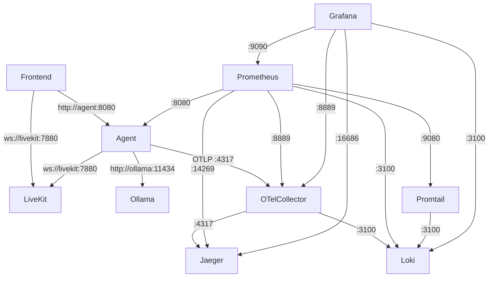

# Docker Compose Networking Architecture

## Port Mappings Summary

All services use the `agent-net` bridge network internally. Here are the exposed ports:

| Port | Service | Purpose | Protocol |
|------|---------|---------|----------|
| **3000** | Grafana | Web UI for dashboards | HTTP |
| **3001** | Frontend | Agent Web UI (maps to internal 3000) | HTTP |
| **3100** | Loki | Log aggregation API | HTTP |
| **4317** | OTel Collector | OTLP gRPC receiver | gRPC |
| **4318** | OTel Collector | OTLP HTTP receiver | HTTP |
| **7880** | LiveKit | HTTP API | HTTP |
| **7881** | LiveKit | RTC/WebRTC | TCP |
| **7882** | LiveKit | TURN/UDP | UDP |
| **8889** | OTel Collector | Prometheus metrics exporter | HTTP |
| **9090** | Prometheus | Web UI & API | HTTP |
| **11434** | Ollama | LLM API | HTTP |
| **13133** | OTel Collector | Health check endpoint | HTTP |
| **14268** | Jaeger | Collector HTTP | HTTP |
| **16686** | Jaeger | Web UI | HTTP |
| **55679** | OTel Collector | zPages debugging | HTTP |

## ✅ Port Conflict Analysis

**No conflicts detected!** Each port is unique and properly mapped. Note:
- Frontend uses `3001:3000` (external:internal) to avoid conflict with Grafana's 3000
- All other services use matching internal/external ports

## Internal Service Communication

Services communicate internally using Docker DNS names (no port exposure needed):

### Internal-Only Services
- **Agent**: No external ports (metrics on internal 8080)
- **Promtail**: No external ports (metrics on internal 9080)

### Service Dependencies & Communication



## Health Check Endpoints

| Service | Health Check URL | Internal Port |
|---------|-----------------|---------------|
| LiveKit | http://localhost:7880 | 7880 |
| Agent | Process check (pgrep) | N/A |
| Frontend | http://localhost:3000 | 3000 |
| Ollama | http://localhost:11434/api/tags | 11434 |
| OTel Collector | http://localhost:13133/health | 13133 |
| Jaeger | http://localhost:14269/ | 14269 |
| Loki | http://localhost:3100/ready | 3100 |
| Prometheus | http://localhost:9090/-/healthy | 9090 |
| Grafana | http://localhost:3000/api/health | 3000 |

## Network Security Notes

1. **Bridge Network**: All services use a single `agent-net` bridge network
2. **Internal Communication**: Services can reach each other by name (e.g., `http://loki:3100`)
3. **External Access**: Only necessary ports are exposed to the host
4. **Secret Management**: Sensitive data passed via Docker secrets, not environment variables

## Common Networking Issues & Solutions

### Issue: "Address already in use"
**Solution**: Check if another service is using the port:
```bash
# macOS/Linux
lsof -i :PORT_NUMBER

# Kill the process or change the port mapping in docker-compose.yml
```

### Issue: Service can't connect to another service
**Solution**: Use the service name, not localhost:
- ❌ `http://localhost:11434` (from inside container)
- ✅ `http://ollama:11434` (using Docker DNS)

### Issue: Frontend can't connect to backend
**Solution**: Frontend runs in browser, needs localhost URLs:
- Frontend → Backend: Use `http://localhost:8080`
- Frontend → LiveKit: Use `ws://localhost:7880`

## Port Availability Check Script

```bash
#!/bin/bash
# Check if required ports are available before starting

PORTS=(3000 3001 3100 4317 4318 7880 7881 7882 8889 9090 11434 13133 14268 16686 55679)

for PORT in "${PORTS[@]}"; do
    if lsof -Pi :$PORT -sTCP:LISTEN -t >/dev/null 2>&1; then
        echo "❌ Port $PORT is already in use"
    else
        echo "✅ Port $PORT is available"
    fi
done
```